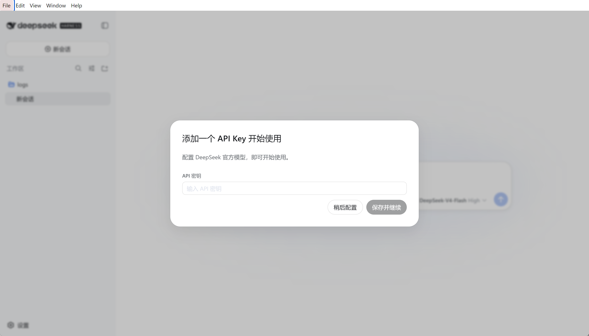
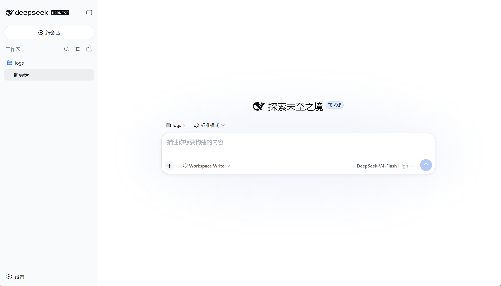
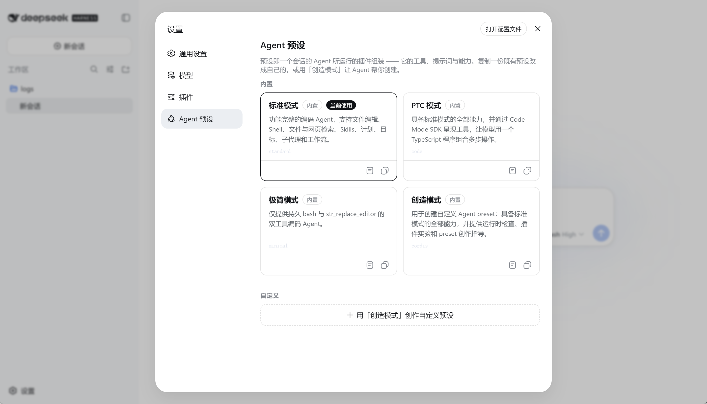

# DeepSeek Harness — Desktop 客户端（Electron 薄外壳）

> **⚠️ 注意**：本程序不是独立项目。需要先 `git clone https://github.com/deepseek-ai/deepseek-harness.git` 编译 Harness 源码，再将本目录（`desktop/`）拷贝到 Harness 仓库中进行编译，生成客户端可执行文件。

把 DeepSeek Harness 的 `dsh web` 运行时以原生窗口形式交付的 **Electron 薄外壳**。







Harness 本体是一个 Node 进程（`dsh web` = `--profile web`，boot host 运行时 + webserver +
构建好的 React 前端，监听 `http://127.0.0.1:3080`）。所有重活都在这个进程里；本外壳只负责：

1. 拉起 harness 运行时（`desktop/main.mjs`）
2. 等待其打印的地址（默认 `http://127.0.0.1:3080`）
3. 在原生 `BrowserWindow` 中渲染该地址，并管理 harness 子进程的生命周期

这个方案贴合项目官方设计路线：架构笔记《GUI 分层与 RPC 协议》明确预留了
“在 Electron 中使用与 `dsh web` 相同的 Web 技术启动”。本外壳复用现有的 host/client
全部能力，无需重复实现任何业务逻辑。

## 两种运行模式

| 模式 | 判定 | harness 来源 | Node 来源 |
|---|---|---|---|
| **开发** | `app.isPackaged === false`（或 `DSH_DEV=1`） | 检出的仓库 `apps/cli/lib/bin.js --profile web` | 系统 `node`（复用仓库 node_modules 与原生插件） |
| **打包** | `app.isPackaged === true` | `resources/runtime` 部署闭包 | `resources/node`（可选，本地捆绑） |

## 目录结构

```
desktop/
  main.mjs                    Electron 主进程（薄外壳）
  electron-builder.yml        打包配置（Windows x64: nsis + portable）
  package.json                仅含 electron / electron-builder 开发依赖
  scripts/
    dev.mjs                   开发模式启动
    prepare-runtime.mjs       预安装全部依赖 + 可选 Node/Python 运行时
  resources/                  (gitignore) 预安装的运行时载荷
    runtime/                  harness 部署闭包：node_modules + dsh bin + web dist
    node/                     (可选) 捆绑的 Node 运行时
    python/                   (可选) 捆绑的 Python 运行时
```

## 快速开始

### 前置

- 仓库根目录已 `pnpm install` 且 `pnpm build`（`apps/cli/lib` 与 `apps/web/dist` 已生成）。
- 首次运行需在 `desktop/` 安装外壳依赖：

```sh
pnpm --dir desktop install      # 或 cd desktop && npm install
```

### 开发模式（验证本地可启动）

```sh
pnpm --dir desktop dev
```

会拉起仓库的 `dsh web` 并打开原生窗口加载 UI。开发模式直接复用仓库现有
node_modules 与原生插件，不压缩、不生成产物——用于快速验证。

### 预安装全部依赖与运行时

```sh
pnpm --dir desktop prepare:runtime
```

该脚本会把：

- **全部 Node 依赖**（`@deepseek-ai/*` 插件 + 三方依赖 + Web 前端 dist）通过
  `pnpm deploy` 物化为自包含的 `resources/runtime` 闭包——即“预先安装所有依赖”。
  前端 dist 经 `require.resolve('@deepseek-ai/dsh-web-frontend/dist/index.html')`
  通过 node_modules 解析，因此闭包天然自包含，无需改路径。
- **Node 运行时**（可选）：设置 `DSH_VENDOR_NODE=1` 会下载 Node win-x64 到
  `resources/node`，让最终用户无需安装 Node。
- **Python 运行时**（可选）：设置 `DSH_PYTHON_SOURCE=<便携 Python 目录>` 会将其
  拷贝到 `resources/python`（供 Python SDK / code-runtime 离线使用）。

> 说明：为免影响你正在快速迭代的仓库，`desktop/` 不在 pnpm workspace 里，是独立
> 自包含工程，拥有自己的依赖与忽略规则。

### 打包 Windows 安装器

先 `prepare:runtime` 生成载荷，再：

```sh
pnpm --dir desktop build:win
```

在 `desktop/dist/` 生成 `DeepSeek Harness-Setup-<version>.exe`（nsis 安装器）与
`DeepSeek Harness-Portable-<version>.exe`（绿色版）。二者都内嵌 `resources/runtime`
（+ 可选的 node/python），离线可用。

## 一次性说明 / 注意

- **原生插件 ABI**：`prepare:runtime` 物化的 node_modules 里的原生模块
  （node-pty、koffi、better-sqlite3 等）是在打包机器的 Node 版本下构建的。若最终
  用户机不装 Node，请在打包机用 `DSH_VENDOR_NODE=1` 捆绑**同一个** Node 版本，
  使 ABI 匹配。开发模式不受此影响（直接用系统 Node）。
- **Visual C++ 运行时（重要）**：闭包内的原生模块（尤其 koffi 驱动的"打开文件夹"
  对话框）依赖 `msvcp140.dll / vcruntime140.dll / vcruntime140_1.dll`（VC++ 2015-2022
  Redistributable）。**未安装该运行时的机器上，目录选择会失败**，报
  `... worker exited before reporting a result`。`prepare:runtime` 会自动从构建机
  `System32` 把这几个可再分发 DLL 拷贝到 `resources/node/`，`main.mjs` 将 `resources/node`
  注入 harness 的 PATH；因此无需用户另行安装运行库。这些 DLL 属于可再分发组件，
  可随客户端分发。
- **原生选择器自动降级**：Windows 原生"打开文件夹"对话框在子进程里用 koffi 驱动
  COM。若某台机器上它的依赖无论如何无法初始化（CRT/ABI 损坏、shell COM 异常等），
  harness 启动时会先对原生对话框做一次**无窗口自检**；自检失败则自动改用
  `browse` 交互（客户端内置的纯 Web 目录树，不依赖任何原生组件），保证在所有机器上
  都能选择文件夹，而不是抛 `worker exited before reporting a result`。启动日志会打印
  `falling back to the browse picker` 提示。
- **退出清理**：窗口关闭/应用退出时，外壳会 `taskkill /T /F` 拉起的 harness
  进程组，避免遗留 node-pty / sandbox 子进程。
- **自定义图标**：把 `desktop/assets/icon.ico` 放入并在 `electron-builder.yml` 的
  `win.icon` 上引用（当前用 Electron 默认图标）。
